# 1. Lệnh echo
- Lệnh echo sẽ in ra ký tự kèm theo sau echo:

# 2. Lệnh pwd
- Lệnh pwd (print working directory) sẽ in ra thư mục mà máy chủ đang hoạt động tại:

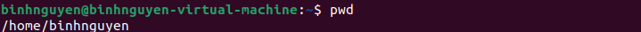

# 3. Lệnh cd
- Lệnh cd (change directory) là lệnh thay đổi thư mục mà máy chủ hoạt động:

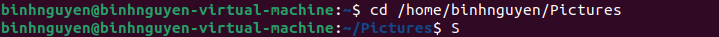

    - $ cd . : thay đổi tới thư mục hiện tại mà máy chủ đang hoạt động.
    - $ cd ..: thay đổi tới thư mục mẹ của thư mục hiện tại mà máy chủ đang hoạt động.
    - $ cd ~: thay đổi tới thư mục home.
    - $ cd -: thay đổi tới thư mục trước đó mà máy chủ hoạt động.
 
 # 4. Lệnh ls
 - Lệnh ls (list directories) liệt kê ra các thư mục tồn tại:

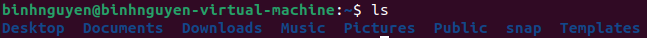

    - ls -l: in ra các thư mục đang tồn tại kèm theo một số thông tin như user, group, quyền truy cập thư mục, ngày khởi tạo,...
    
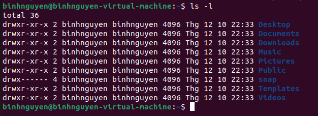

    - ls -a: hiển thị cả thư mục bị ẩn.
    
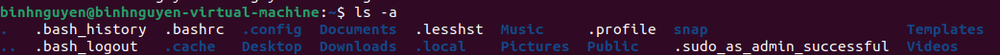

    - ls -R: liệt kê nội dung của thư mục hiện tại và tất cả các thư mục con theo cách đệ quy (recursive).
   
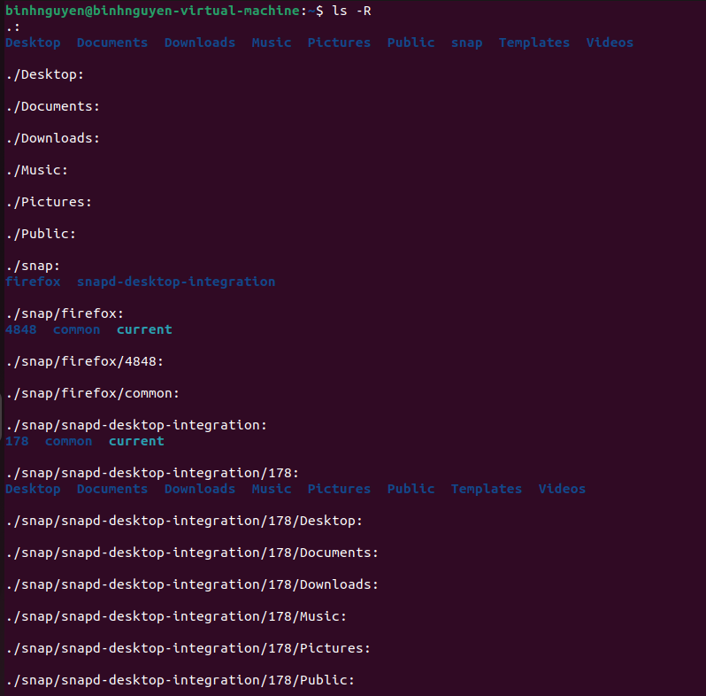

    - ls -r: liệt kê tệp và thư mục theo thứ tự ngược lại (reverse), tức là thay đổi thứ tự sắp xếp mặc định (từ A → Z sẽ thành Z → A).
    

    - ls -t: liệt kê các tệp và thư mục trong thư mục hiện tại, được sắp xếp theo thời gian sửa đổi (modification time). Tệp hoặc thư mục được sửa đổi gần đây nhất sẽ được hiển thị đầu tiên.

# 5. Lệnh touch
- Lệnh touch sẽ tạo ra một file mới tại thư mục mà máy chủ đang hoạt động:

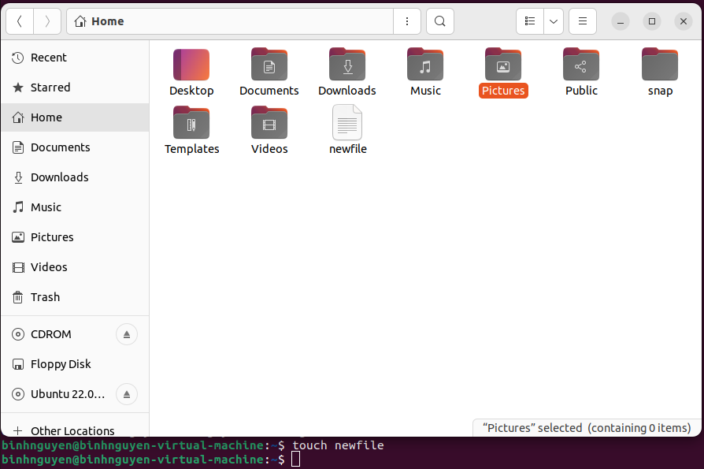

# 6. Lệnh cat
- Lệnh cat sẽ hiển thị ra nội dung của file bất kỳ với output ngắn:

# 7. Lệnh file
- Lệnh file sẽ hiển thị ra loại của file đó:

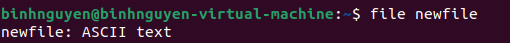

# 8. Lệnh less
- Lệnh less sẽ hiển thị nội dung của văn bản có output lớn:
  
    - q - thoát khỏi lệnh less và quay trở lại shell
    - Page up, Page down, Up and Down - sử dụng nút lên xuống hoặc điều chỉnh của file
    - g - chuyển tới đầu file
    - G - chuyển tới cuối file
    - /search - tìm kiếm text bằng cách gõ lệnh / kèm theo text
    - h - vào file hướng dẫn sử dụng less

# 9. Lệnh history
- Lệnh history sẽ hiển thị lại tất cả các lệnh đã được sử dụng:

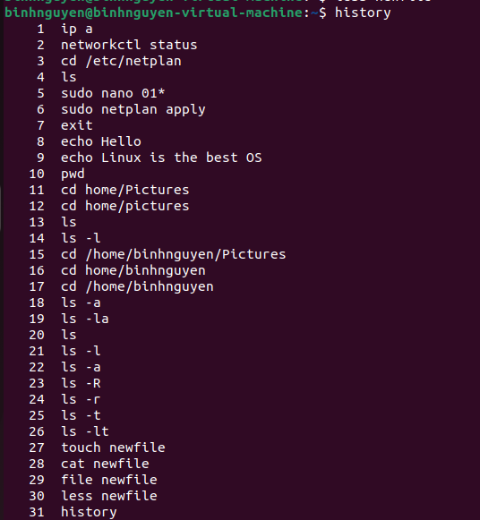

# 10. Lệnh cp
- Lệnh cp (copy) dùng để copy file hoặc thư mục:

    - $ cp *.jpg /home/binhnguyen/Pictures: sao chép tất cả các file có đuổi jpg chuyển qua thư mục Pictures.
    - $ cp -r Pumpkin/ /home/binhnguyen/Documents: sao chép toàn bộ thư mục tên Pumpkin và chuyển vào thư mục Documents.
    - $ cp -i mycoolfile /home/binhnguyen/Pictures: tùy chọn này yêu cầu xác nhận tương tác từ người dùng trước khi ghi đè lên một tệp đã tồn tại trong thư mục đích.
    
    Nếu trong thư mục /home/binhnguyen/Pictures đã có một tệp trùng tên với mycoolfile, sẽ được hỏi: overwrite '/home/binhnguyen/Pictures/mycoolfile'? (y/n)

# 11. Lệnh mv
- Lệnh mv (move) cho phép di chuyển các file hoặc có thể dùng để đổi tên file đó.
   - $ mv oldfile newfile: chuyển đổi tên file cũ là oldfile thành tên file mới là newfile.
   - $ mv file2 /home/binhnguyen/Documents: chuyển file2 tới thư mục Documents.
   - $ mv file_1 file_2 /somedirectory: chuyển đồng thời nhiều file trong cùng một câu lệnh.
   - $ mv directory1 directory2: đổi tên thư mục.
   - $ mv -i directory1 directory2: yêu cầu xác nhận trước khi đổi tên thư mục
   - $ mv -b directory1 directory2: tùy chọn -b (backup) tạo bản sao lưu của tệp hoặc thư mục nếu tệp cùng tên đã tồn tại trong thư mục đích. Nếu tệp hoặc thư mục directory1 có cùng tên với tệp/thư mục đã có trong directory2, thì phiên bản hiện tại trong directory2 sẽ được đổi tên với hậu tố ~ (ví dụ: directory1~) trước khi lệnh mv ghi đè lên tệp đó.

# 12. Lệnh mkdir
- Lệnh mkdir (make directory) sẽ tạo ra thư mục mới:

# 13. Lệnh rm
- Lệnh rm (remove) dùng để xóa tệp tin hoăc thư mục trong hệ thống.
 
   - $ rm -f file1: xóa mà không cần yêu cầu xác nhận.
   - $ rm -i file1: yêu cầu xác nhận trước khi xóa. Sau khi ấn lệnh trên sẽ xuất hiện rm: remove regular file 'file1'? y
   - $ rm -r directory: xóa tất cả nội dung bên trong một thư mục.
   - $ rm -rf directory: xóa tất cả nội dung bên trong một thư mục mà không cần xác nhận.

# 14. Lệnh find
- Lệnh find dùng để tìm kiếm một tệp tin cụ thể:

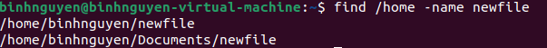
# 15. Lệnh help
- Lệnh help dùng để tìm hiểu cách sử dụng một lệnh hoặc kiểm tra các tùy chọn (flags) khả dụng cho lệnh đó.

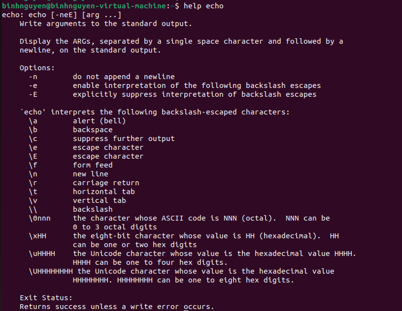

- Có thể sử dụng lệnh man với chức năng tương tự.
# 16. Lệnh man
- Lệnh man hiển thị ra một manual page cho một lệnh ở dạng less, cung cấp cách sử dụng và một số ký tự phụ trợ đi kèm:

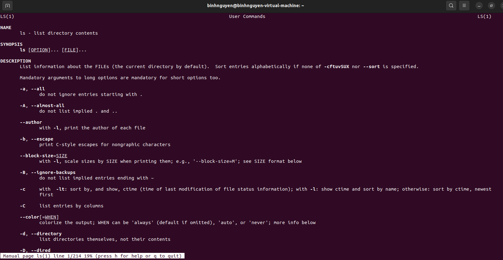

# 17. Lệnh whatis
- Lệnh whatis cung cấp description về một lệnh bất kỳ:

# 18. Lệnh alias
- Lệnh alias để đặt tên cho một lệnh hoặc chuỗi command trong linux. Những lệnh alias được thực hiện sẽ không được lưu sau khi reboot, muốn lưu vĩnh viễn lệnh alias cần add vào ~/.bashrc.

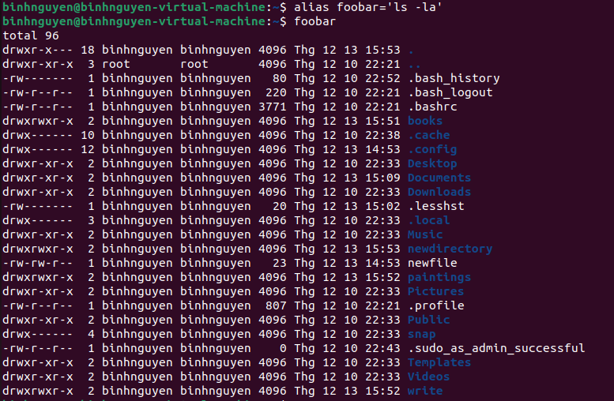

- Để xóa lệnh alias sử dụng câu lệnh unalias.

# 19. Lệnh exit
- Lệnh exit dùng để thoát khỏi shell, có thể dùng lệnh logout với chức năng tương tự.

