# 1. Các thành phần mạng có trong VMware
Các thành phần mạng ảo trong VMware Workstation bao gồm switch ảo, network adapter ảo, DHCP server ảo và thiết bị NAT.
## 1.1 Virtual Switch
Switch đảm nhiệm vai trò tương tự như switch vật lý, kết nối các thiết bị mạng lại với nhau. Switch ảo hay còn gọi là mạng ảo ở trong VMware với các tên tương ứng như VMnet0, VMnet1, VMnet2,...Một số mạng ảo sẽ được kết nối với một chế độ mạng mặc định như:

| Chế độ mạng | Tên switch |
|:------------| :----------|
| Bridged     | VMnet0     |
| Host-Only   | VMnet1     |
| NAT         | VMnet8     |

VMware Workstation cho phép tạo ra 20 switch ảo cho máy ảo Windows và 255 switch ảo cho máy ảo Linux. Trong đó, một switch ảo trên Windows có thể kết nối không giới hạn thiết bị, còn một switch ảo trên Linux chỉ có thể kết nối với 32 thiết bị.

## 1.2 Virtual Network Adapter
Khi tiến hành tạo máy ảo, VMware sẽ tạo network adapter ảo cho máy ảo đó. Một số network adapter xuất hiện trong máy ảo như AMD PCNET PCI adapter, Intel Pro/1000 MT Server Adapter, hoặc là Intel 82574L Gigabit Network Connection. Ở trong máy ảo chạy hệ điều hành windows vista, windows 7, và windows 8, adapter là Intel Pro/1000 MT Server Adapter. Còn ở trong máy ảo chạy hệ điều hành windows 8.1 và windows 10, adapter là Intel 82574L Gigabit Network Connection.
## 1.3 Virtual DHCP Server
DHCP Server ảo cung cấp địa chỉ IP cho các máy ảo. DHCP Server chỉ hoạt động ở trong chế độ NAT và Host-Only, nhưng không hoạt động trong chế độ Bridge.
## 1.4 NAT device
Trong cấu hình mạng NAT, thiết bị NAT sẽ thực hiện việc trao đổi dữ liệu giữa các máy ảo với nhau, hoặc giữa máy ảo với mạng bên ngoài, nhận diện gói tin gửi đến từng máy ảo và trả nó đến đúng đích.
# 2. NAT Network
Khi cài đặt VMware Workstation, mạng NAT sẽ được gắn với VMnet8. Khi cài đặt một máy ảo mới trên VMware, nó được mặc định là mạng NAT.

Trong mạng NAT, máy ảo sẽ không có địa chỉ IP riêng để kết nối ra ngoài mạng, thay vào đó một mạng private được thiết lập trong máy chủ. Máy ảo sẽ được cấp địa chỉ từ một DHCP Server ảo.

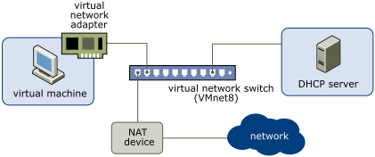

Máy ảo và máy chủ sẽ dùng chung một mạng không được định danh trên mạng Internet. NAT sẽ chuyển đổi địa chỉ IP của máy ảo trong mạng private đấy thành địa chỉ IP của máy chủ. Khi máy ảo gửi gói tin ra ngoài mạng, thì gói tin đấy sẽ được định danh dưới dạng IP của máy chủ. Thiết bị network adapter ảo cho phép máy chủ và máy ảo giao tiếp với nhau.

NAT cho phép máy ảo sử dụng các giao thức tin cậy như HTTP để truy cập web, FTP để truyền file hay Telnet để kết nối đến các máy tính khác. 
# 3. Bridged Network
Mạng Bridged sẽ kết nối máy ảo tới mạng thông qua network adapter của máy chủ. Khi cài đặt VMware Workstation, VMnet0 sẽ được gán với mạng Bridged. 

Trong mạng Bridged, thiết bị adapter của máy ảo sẽ kết nối đến thiết bị adapter của máy chủ. Thiết bị adapter của máy chủ sẽ cho phép máy ảo kết nối đến mạng LAN mà máy chủ đang sử dụng. Mạng bridged hoạt động được cả ở trong môi trường mạng không dây hay mạng có dây.

Mạng bridged cấu hình máy ảo với một địa chỉ IP riêng biệt, độc lập so với máy chủ và sẽ được nhận diện là một thiết bị độc lập. 

# 4. Host-Only Network
Khi cài đặt VMware Workstation, chế độ mạng Host-Only sẽ được gắn với VMnet1. 

Trong host-only network, máy ảo và network adapter ảo của máy chủ và sẽ kết nối đến một mạng Ethernet private. Mạng host-only chỉ có khả năng hoạt động giữa các máy ảo với nhau và với máy chủ, và nằm hoàn toàn trong host system. 

Kết nối giữa máy ảo và máy chủ thông qua một virtual network adapter hiệu dụng trên hệ điều hành của máy chủ. Một DHCP Server sẽ đảm nhiệm vai trò cung cấp địa chỉ IP trong host-only network.
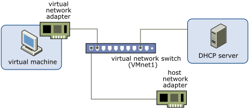
# 5. Sử dụng chế độ mạng NAT cho các máy ảo để truy cập internet
## 5.1 Windows
- Thiết lập mạng NAT cho máy ảo, vào VM chọn Settings:
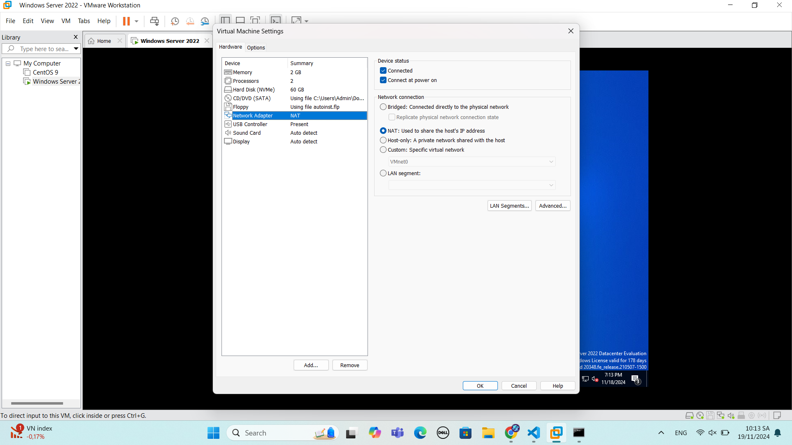
- Chạy cmd trên máy ảo dưới quyền administrtor:
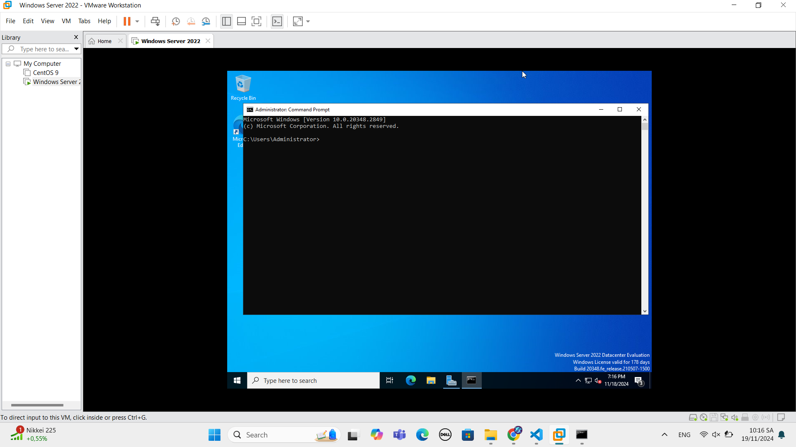
- Gõ lệnh ping google để xác nhận truy cập internet thành công từ máy ảo:
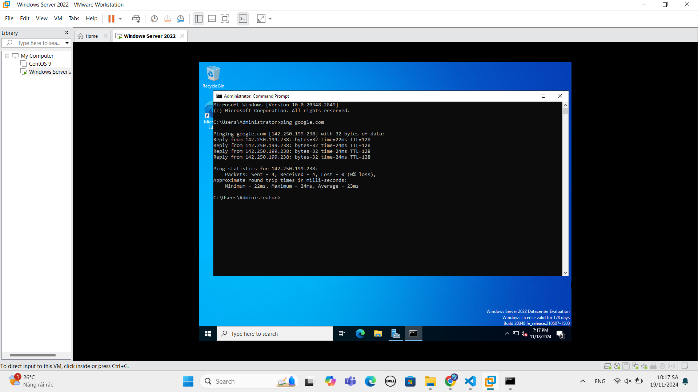
## 5.2 CentOS
- Thiết lập mạng NAT cho máy ảo, vào VM chọn Settings:

- Gõ lệnh ping google để xác nhận truy cập internet thành công từ máy ảo:

## 5.3 Ubuntu
- Thiết lập mạng NAT cho máy ảo, vào VM chọn Settings:

- Gõ lệnh ping google để xác nhận truy cập internet thành công từ máy ảo:
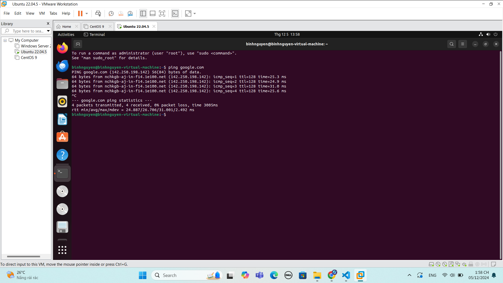
# 6. Sử dụng chế độ card Host-only để 2 máy ảo kết nối với nhau
## 6.1 Windows và CentOS
- Thiết lập mạng Host-Only cho máy ảo Windows, vào VM chọn Settings:
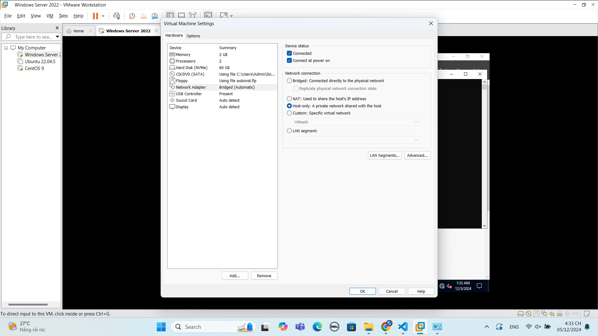
- Thiết lập mạng Host-Only cho máy ảo CentOS, vào VM chọn Settings:
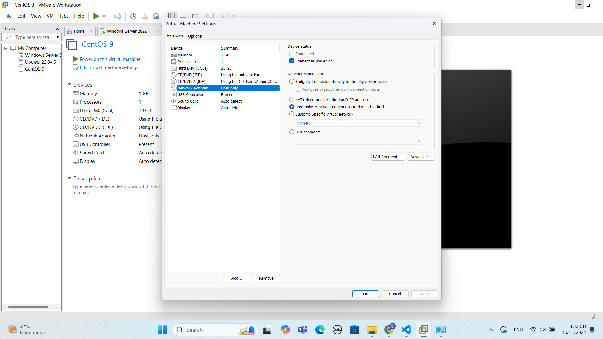
- Kiểm tra địa chỉ IP của máy ảo Windows:
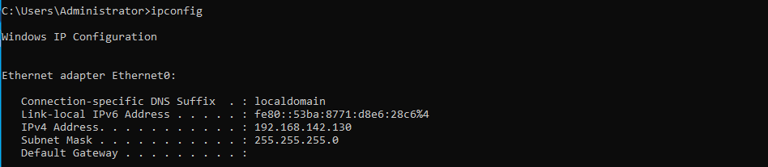
- Kiểm tra địa chỉ IP của máy ảo CentOS:
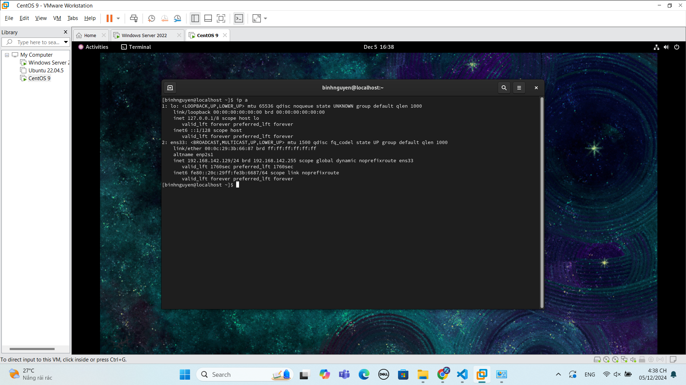
- Kiểm tra lệnh ping từ máy ảo Windows qua CentOS:
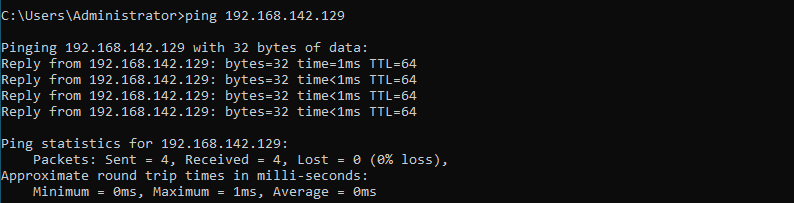
- Kiểm tra lệnh ping từ máy ảo CentOS qua Windows:

## 6.2 CentOS và Ubuntu
- Thiết lập mạng Host-Only cho máy ảo CentOS, vào VM chọn Settings:

- Thiết lập mạng Host-Only cho máy ảo Ubuntu, vào VM chọn Settings:

- Kiểm tra địa chỉ IP của máy ảo CentOS:

- Kiểm tra địa chỉ IP của máy ảo Ubuntu:
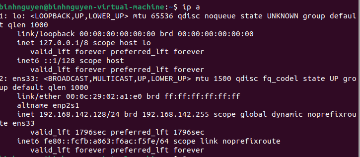
- Kiểm tra lệnh ping từ máy ảo CentOS qua Ubuntu:

- Kiểm tra lệnh ping từ máy ảo Ubuntu qua CentOS:
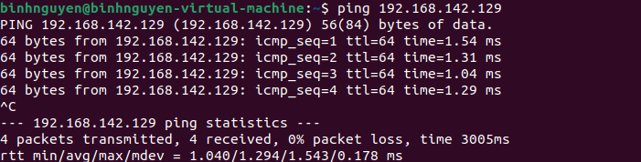

## 6.3 Ubuntu và Windows
- Thiết lập mạng Host-Only cho máy ảo Windows, vào VM chọn Settings:

- Thiết lập mạng Host-Only cho máy ảo Ubuntu, vào VM chọn Settings:

- Kiểm tra địa chỉ IP của máy ảo Windows:

- Kiểm tra địa chỉ IP của máy ảo Ubuntu:

- Kiểm tra lệnh ping từ máy ảo Windows qua Ubuntu:
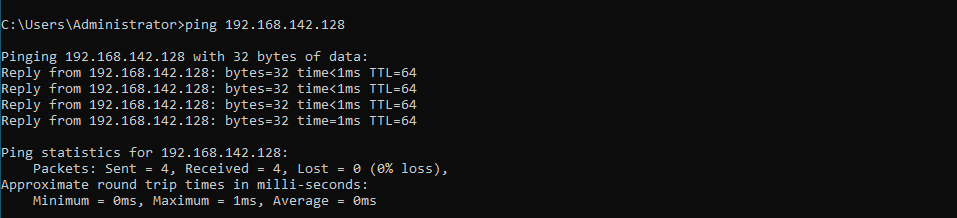
- Kiểm tra lệnh ping từ máy ảo Ubuntu qua Windows:

# 7. Sử dụng 1 card Bridged để từ máy ảo ping ra máy laptop cá nhân
## 7.1 Windows 
- Thiết lập mạng Bridged cho máy ảo, vào VM chọn Settings:
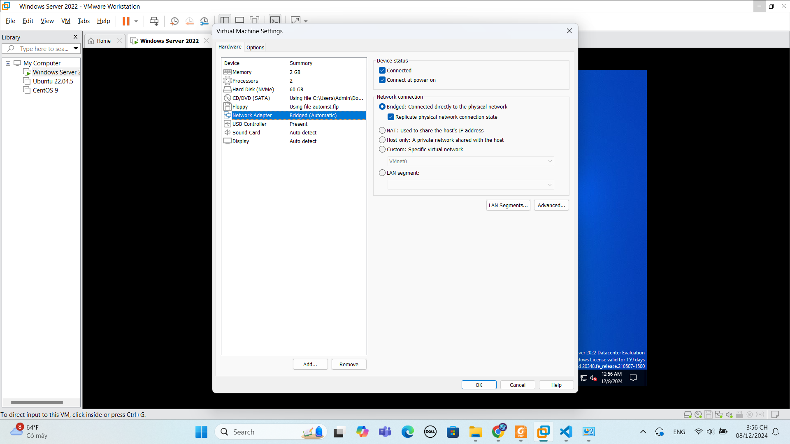
- Kiểm tra địa chỉ IP của máy tính cá nhân:

- Tiến hành ping từ máy ảo windows ra máy tính cá nhân:
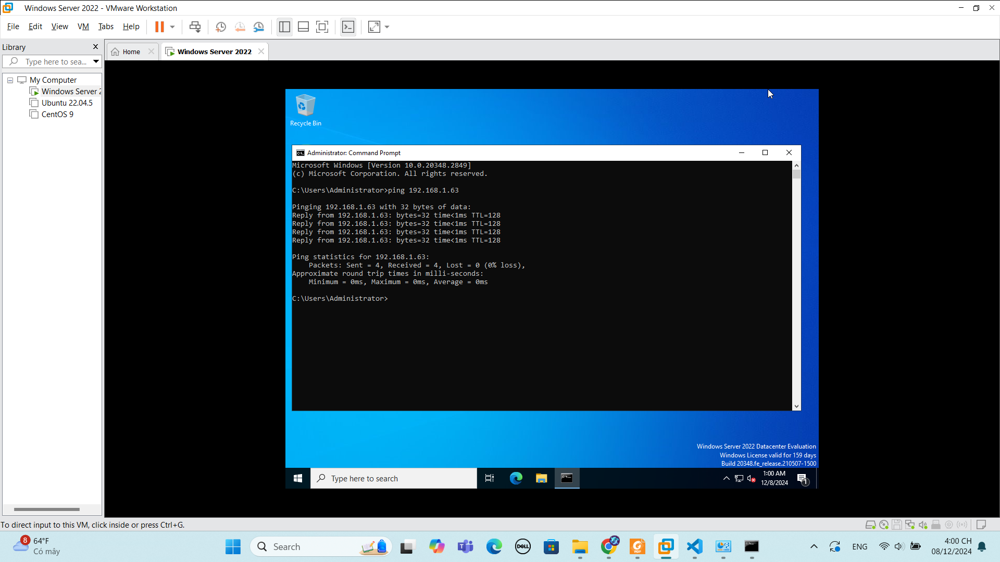

  Lệnh ping được thực hiện thành công.
## 7.2 CentOS
- Thiết lập mạng Bridged cho máy ảo, vào VM chọn Settings:

- Kiểm tra địa chỉ IP của máy tính cá nhân:

- Tiến hành ping từ máy ảo centOS ra máy tính cá nhân:

  
  Lệnh ping được thực hiện thành công.
## 7.3 Ubuntu
- Thiết lập mạng Bridged cho máy ảo, vào VM chọn Settings:
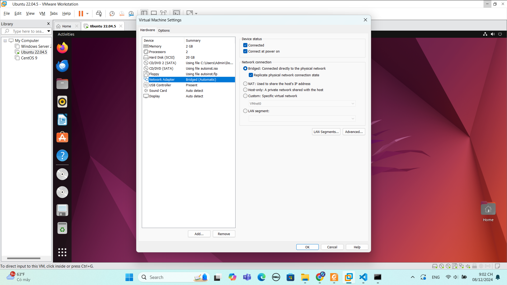
- Kiểm tra địa chỉ IP của máy tính cá nhân:

- Tiến hành ping từ máy ảo ubuntu ra máy tính cá nhân:
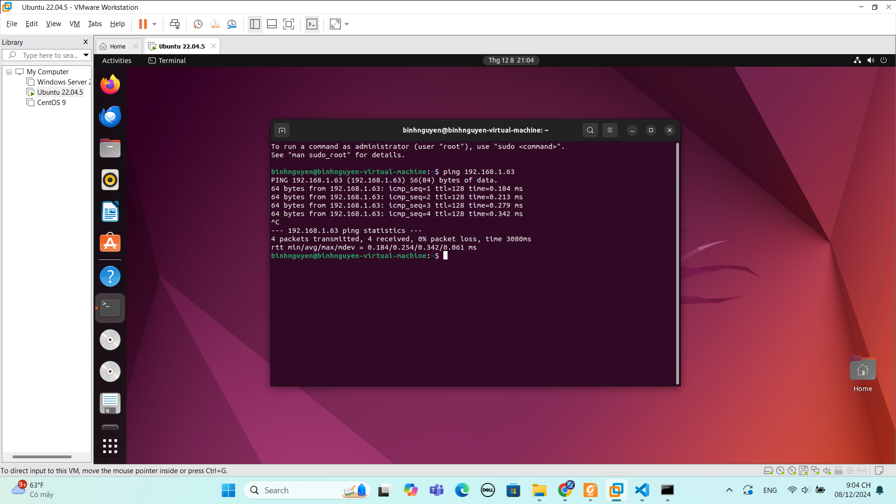
   
  Lệnh ping được thực hiện thành công.
