# 1. Cài đặt máy ảo CentOS 9
- Bước 1: Download phiên bản mới nhất của hệ điều hành CentOS từ đường dẫn sau: (https://www.centos.org/download/).
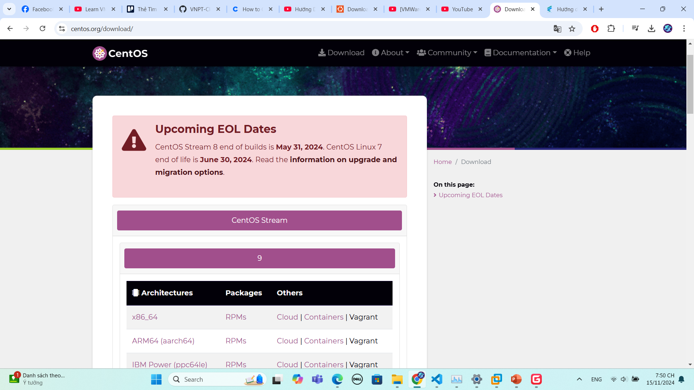
- Bước 2: Vào VMWare Workstation, chọn mục New Virtual Machine để tạo một máy ảo mới.
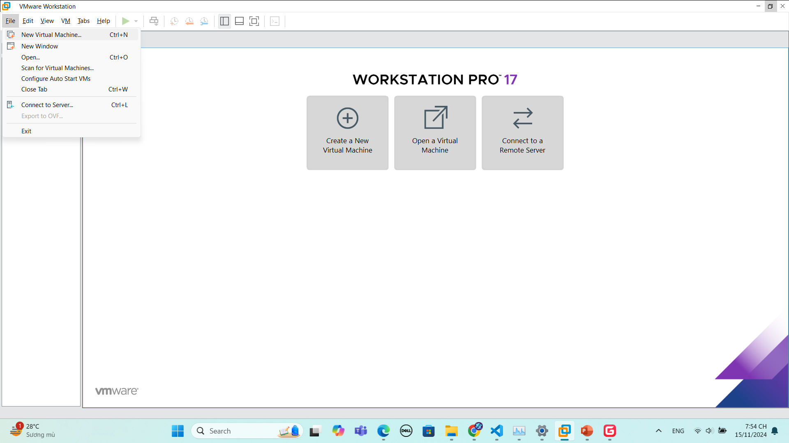
- Bước 3: Chọn vào Typical (recommended) và bấm Next để tiến hành cài đặt.
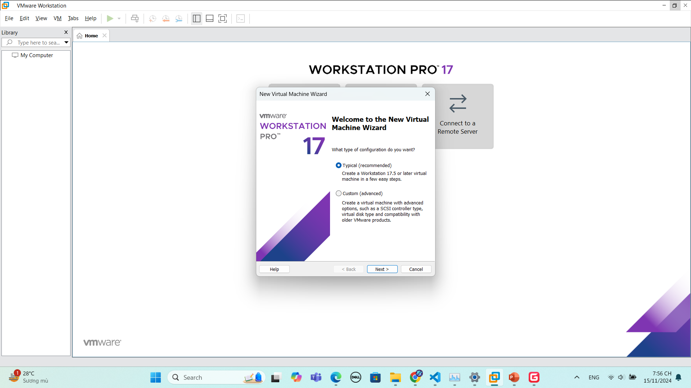
- Bước 4: Chọn file iso chứa hệ điều hành CentOS 9.

- Bước 5: Đặt tên người dùng và mật khẩu cho máy ảo.
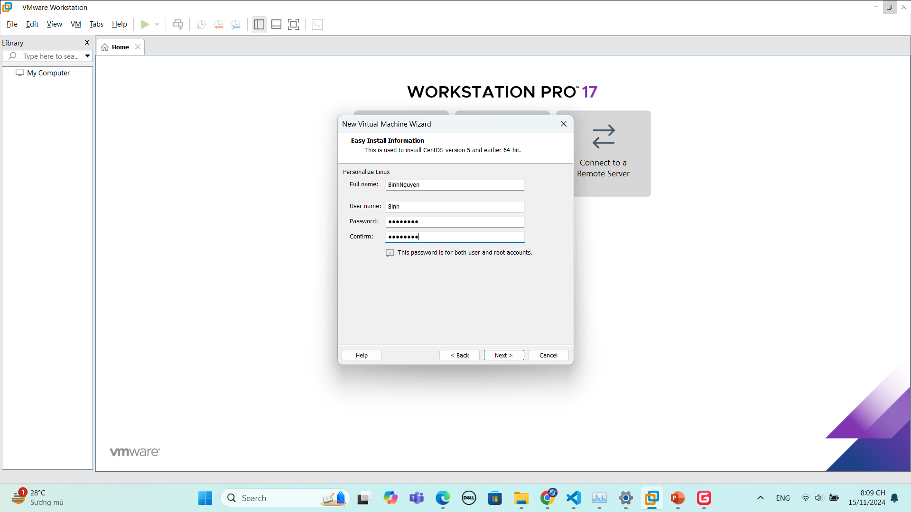
- Bước 6: Đặt tên cho máy ảo và chọn nơi lưu trữ dữ liệu cho máy ảo trên máy chủ.

- Bước 7: Chọn dung lượng ổ đĩa ảo và chọn chia ổ đĩa ảo thành nhiều tệp nhỏ hơn.
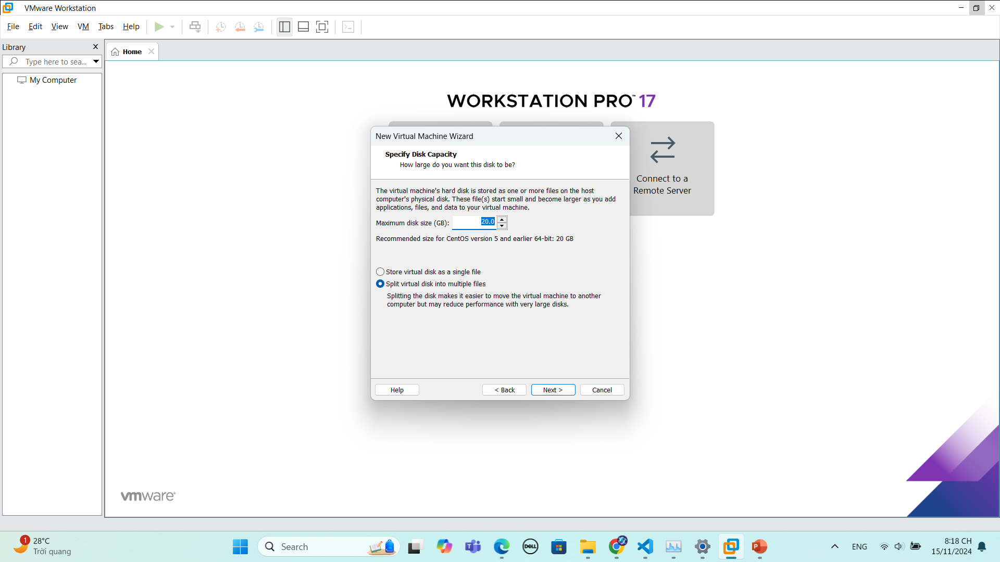
- Bước 8: Tiến hành một số thủ tục cơ bản để hoàn tất cài đặt.

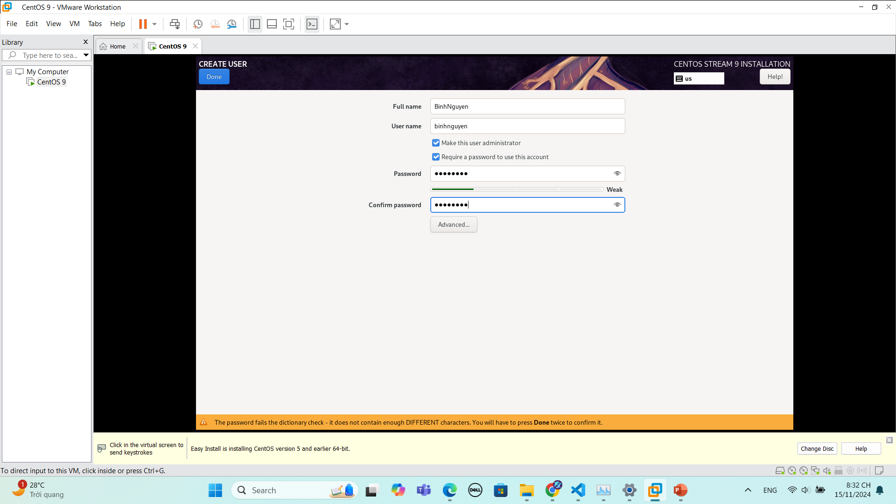

- Bước 9: Khởi động lại máy ảo và hoàn tất cài đặt, hiển thị giao diện như sau:
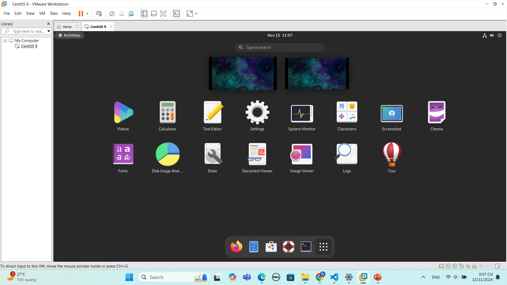
# 2. Cài đặt máy ảo Ubuntu Server 22.04.5
- Bước 1: Download phiên bản Ubuntu Server 22.04.5 từ đường dẫn sau:
(https://releases.ubuntu.com/jammy/)
- Bước 2: Vào VMWare Workstation, chọn mục New Virtual Machine để tạo một máy ảo mới.

- Bước 3: Chọn vào Typical (recommended) và bấm Next để tiến hành cài đặt.

- Bước 4: Chọn file iso tương ứng đã tải xuống của phiên bản Ubuntu Server 22.04.5.
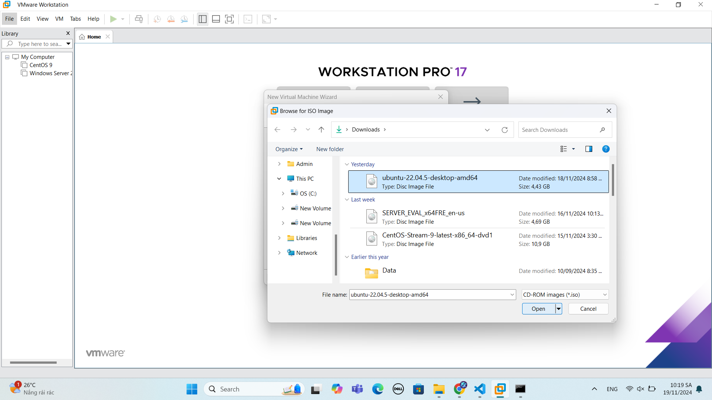
- Bước 5: Đặt tên người dùng và mật khẩu cho máy ảo.
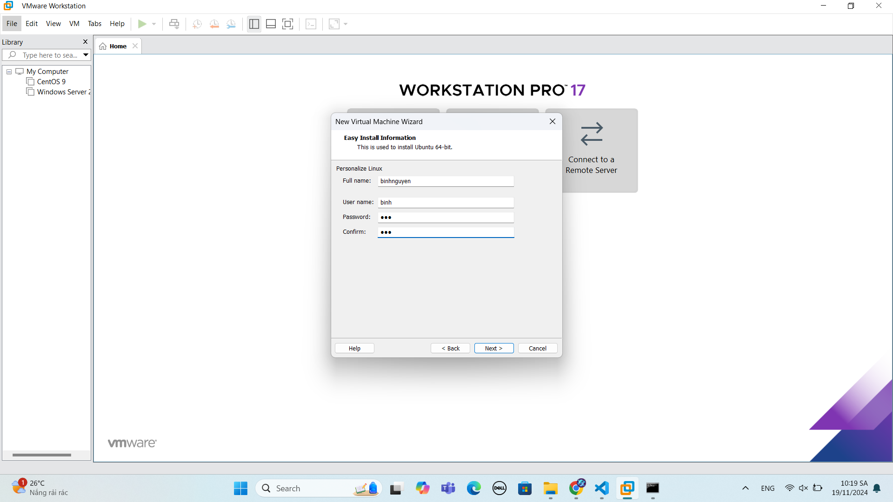
- Bước 6: Đặt tên cho máy ảo và chọn ổ để lưu trữ dữ liệu cho máy ảo.

- Bước 7: Chọn kích thước ổ đĩa cho máy ảo cùng với lựa chọn phân chia ổ đĩa thành nhiều tệp nhỏ hơn.

- Bước 8: Tiến hành một số bước cài đặt cơ bản trong máy ảo:
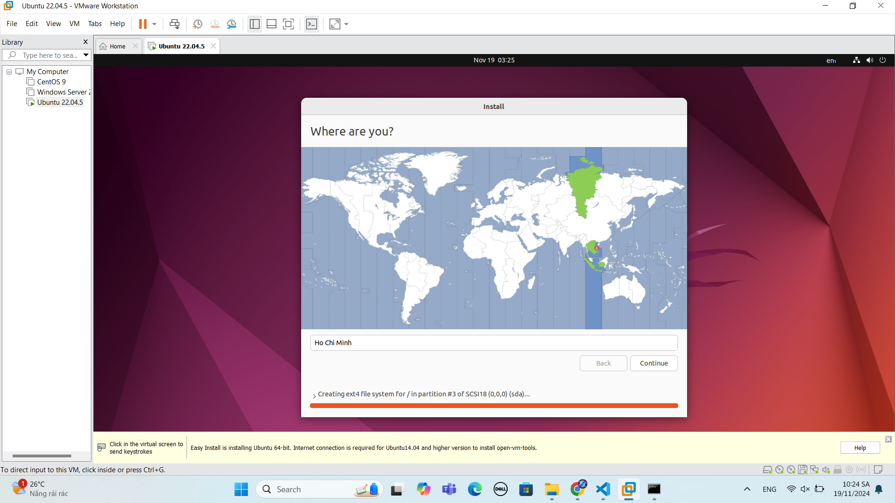
- Bước 9: Hoàn tiết việc thiết lập máy ảo chạy hệ điều hành Ubuntu.
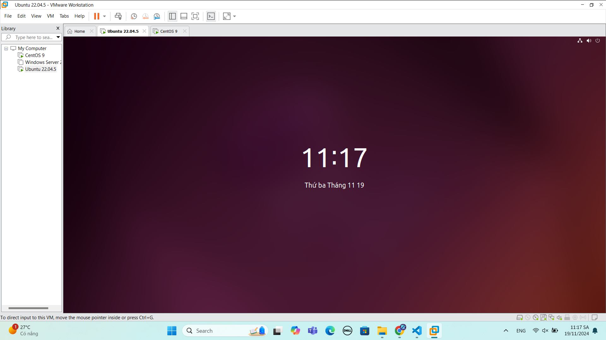

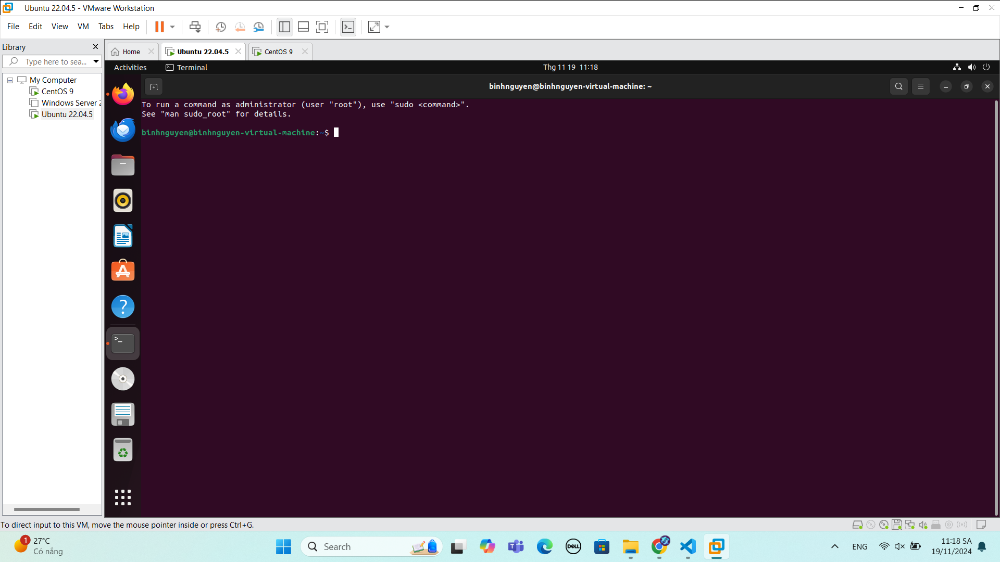

# 3. Cài đặt máy ảo Window Server 2022
- Bước 1: Download phiên bản window server 2022 từ đường dẫn sau:
(https://www.microsoft.com/en-us/evalcenter/evaluate-windows-server-2022)
- Bước 2: Vào VMWare Workstation, chọn mục New Virtual Machine để tạo một máy ảo mới.
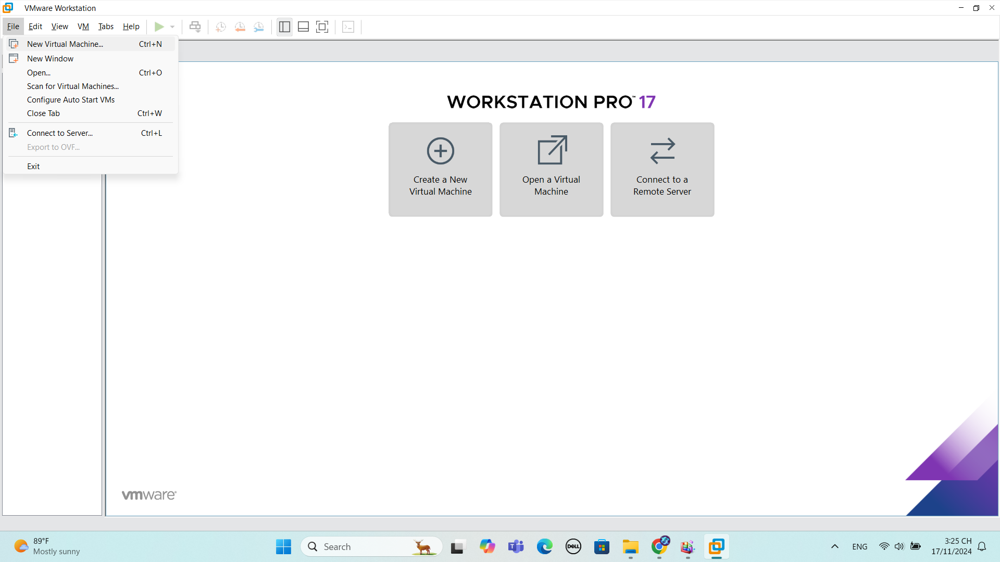
- Bước 3: Chọn vào Typical (recommended) và bấm Next để tiến hành cài đặt.
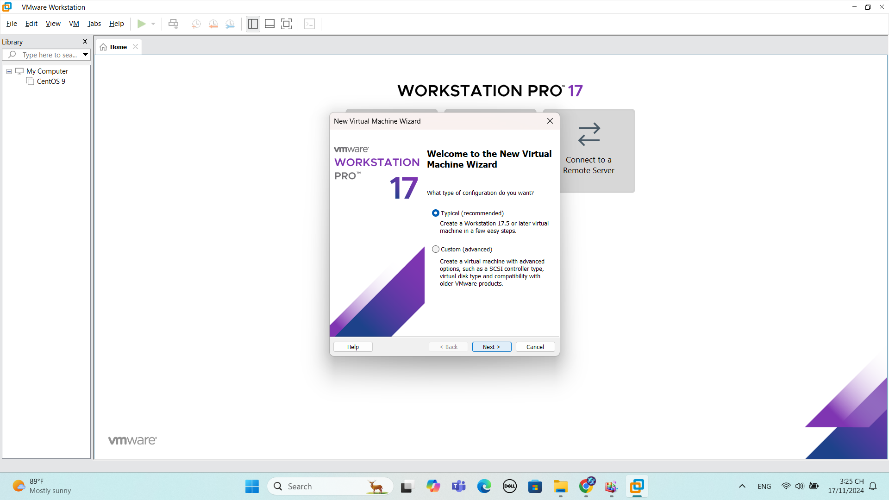
- Bước 4: Chọn file iso tương ứng đã tải xuống của phiên bản window server 2022.

- Bước 5: Đặt tên cho máy ảo và chọn ổ để lưu trữ dữ liệu cho máy ảo.

- Bước 6: Chọn kích thước ổ đĩa cho máy ảo cùng với lựa chọn phân chia ổ đĩa thành nhiều tệp nhỏ hơn.

- Bước 7: Kiểm tra lại các lựa chọn cài đặt và nhấn finish để hoàn tất cài đặt.
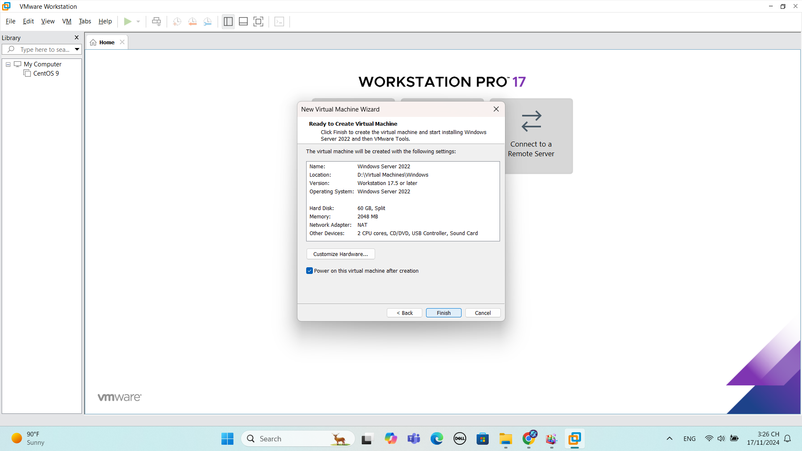
- Bước 8: Chọn phiên bản Datacenter Evaluation (Desktop Exprerience) để cài đặt phiên bản có kèm theo giao diện.

- Bước 9: Tiến hành một số thủ tục sau khi cài đặt máy ảo thành công.
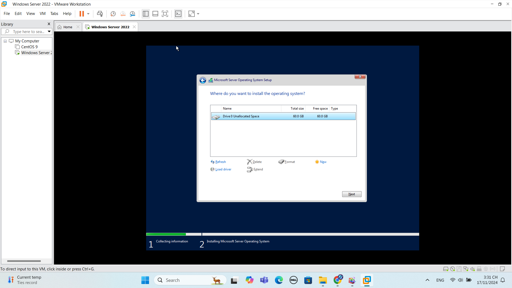

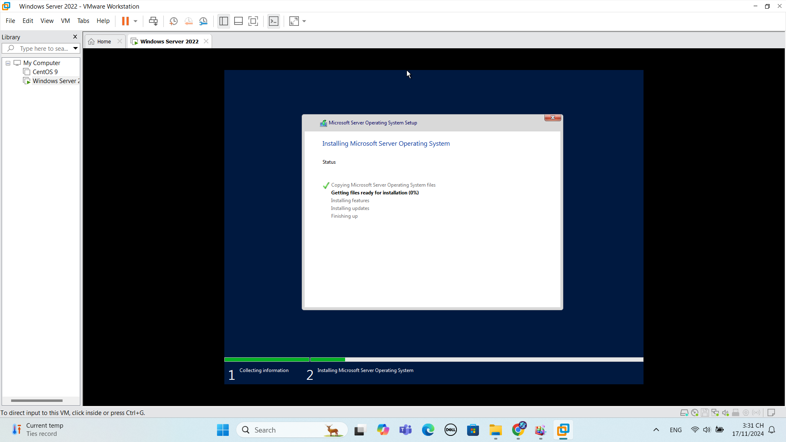

- Bước 10: Hoàn tất cài đặt máy ảo window server 2022.
