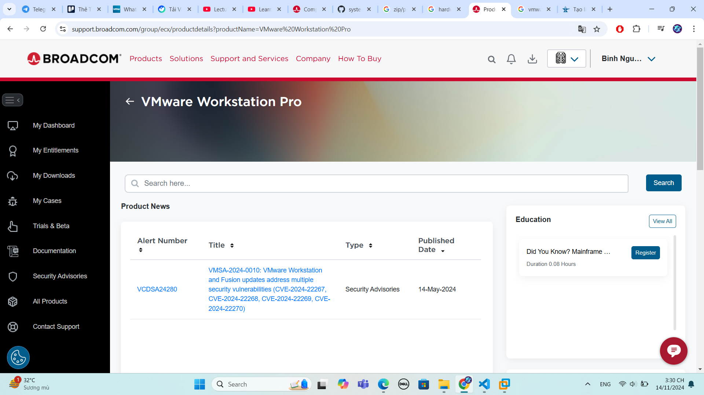
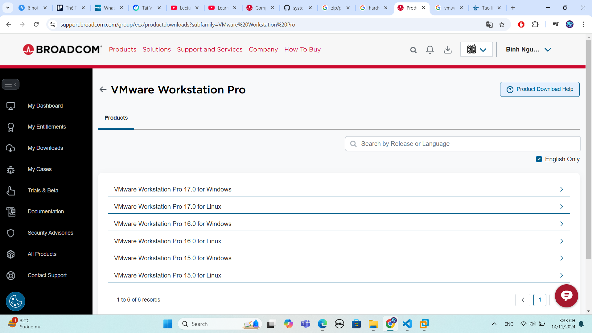
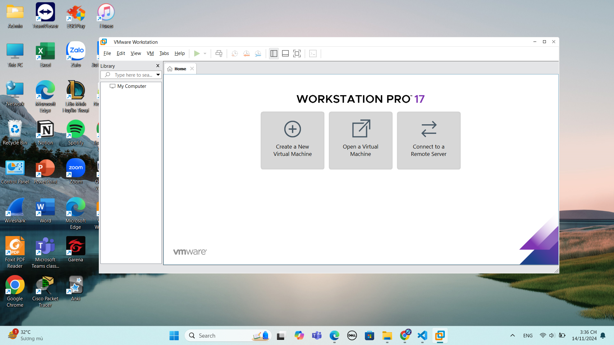

# 1. Tìm hiểu về VMWare Workstation
## 1.1 Tổng quan
VMWare Workstation là một sản phẩm ảo hóa máy tính để bàn. Phần mềm này cung cấp các công cụ để thử nghiệm, phát triển và triển khai phần mềm có sẵn trên Windows và Linux. 

VMWare Workstation hỗ trợ người dùng thiết lập và quản lý nhiều máy ảo (VMs) trên cùng một máy tính. Phiên bản mới nhất của phần mềm này là VMWare Workstation Pro 17.6.1 (release date Oct 10th) đã trình làng nhiều tính năng nổi bật như hỗ trợ hệ điều hành mới, REST API, USB Auto kết nối với máy ảo, vSphere 8, cải thiện hiệu suất NVMe ảo,...
## 1.2 Các tính năng của VMWare Workstation
- Sao chép máy ảo đơn giản và hiệu quả: VMware Workstation Pro hỗ trợ sao chép máy ảo tiết kiệm thời gian và dung lượng đĩa bằng hai cách như sau:

  - Bản sao được Liên kết (Linked Clone): Tạo một bản sao của máy ảo bằng cách chia sẻ dữ liệu với máy ảo gốc, giúp tiết kiệm đáng kể dung lượng đĩa. Phương pháp này nhanh chóng nhưng vẫn dựa trên máy ảo gốc.
  - Bản sao đầy đủ (Full Clone): Tạo một bản sao hoàn toàn độc lập của máy ảo, có thể sử dụng riêng và chia sẻ với người khác mà không phụ thuộc vào máy ảo gốc.
  
- Tính năng tạo điểm khôi phục (snapshot): giúp người dùng quay lại trạng thái trước đó của máy ảo, hữu ích cho việc thử nghiệm và demo tính năng/sản phẩm.
  - Điểm khôi phục (snapshot): tạo một bản sao lưu của máy ảo tại một thời điểm nhất định. Nếu có vấn đề, có thể hoàn nguyên lại trạng thái này. 

  - Snapshot sẽ ghi lại toàn bộ cấu hình và dữ liệu của máy ảo, bao gồm:
    - Dữ liệu và cài đặt: Tất cả các tệp, ứng dụng, và cài đặt của máy ảo vào thời điểm snapshot.
    
    - Trạng thái hệ thống: Những gì đang chạy, vị trí của các tệp đang mở, và các tiến trình hoạt động.
    
- Hỗ trợ thiết lập mạng ảo phức tạp sử dụng IPv4 và IPv6: cho phép người dùng mô phỏng các môi trường mạng thực tế.
- Đồ họa 3D hiệu suất cao
- Khả năng tương thích chéo
- Quyền truy cập hạn chế vào máy ảo: 
  - **Kéo và thả (Drag-and-Drop):** VMware cho phép vô hiệu hóa tính năng kéo và thả giữa máy chủ và máy ảo.
  - **Sao chép và dán (Copy-and-Paste):** Tính năng này có thể bị hạn chế để ngăn người dùng sao chép nội dung, dữ liệu từ máy ảo ra bên ngoài hoặc ngược lại.
  - **Kết nối thiết bị USB:** Bạn có thể ngăn chặn kết nối thiết bị USB vào máy ảo để đảm bảo không ai có thể đưa dữ liệu vào hoặc lấy dữ liệu ra bằng thiết bị ngoại vi.
  - **Mã hóa và bảo vệ máy ảo:** Các máy ảo có thể được mã hóa và bảo vệ bằng mật khẩu để đảm bảo chỉ những người dùng được ủy quyền mới có quyền truy cập.

# 2. Cài đặt VMWare Workstation
Bước 1: Đăng nhập vào trang chủ của Broadcom.

(https://support.broadcom.com/group/ecx/my-dashboard)

Bước 2: Ở giao diện, chọn mục My Dashboard và gõ tìm kiếm VMWare Workstation Pro.

Bước 3: Chọn vào link được hiển thị để tiến hành download.

Bước 4: Chọn phiên bản phù hợp cho hệ điều hành máy chủ.

Bước 5: Tiến hành cài đặt và hoàn tất thiết lập, hiển thị giao diện của VMWare Workstation.

