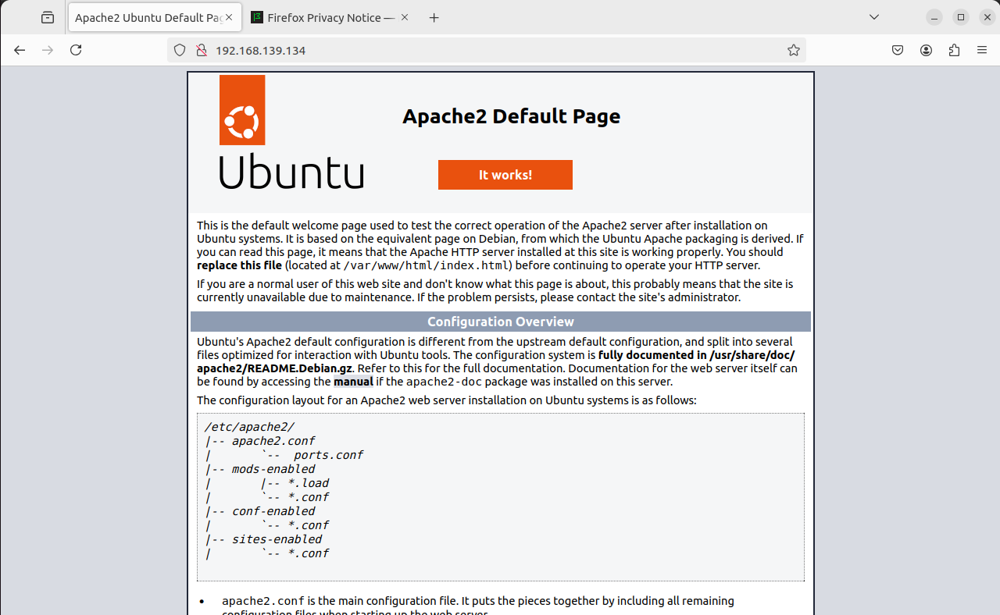
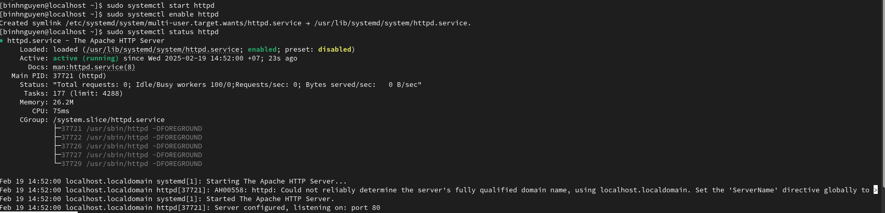
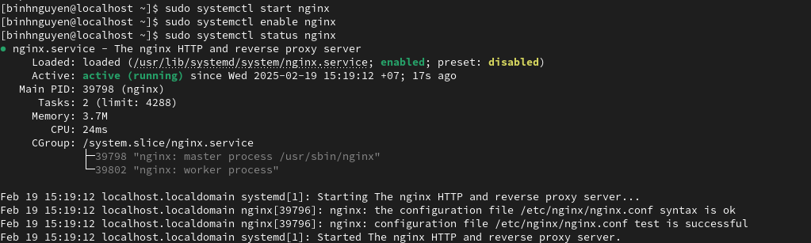
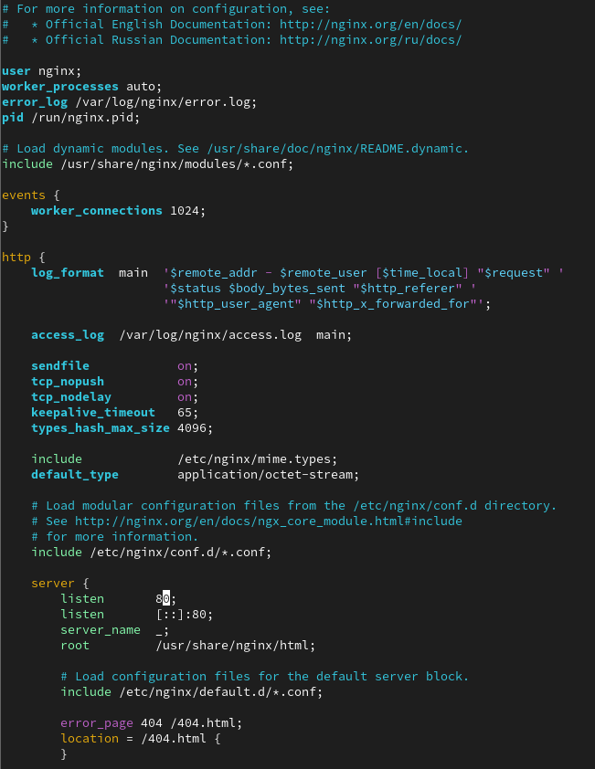

# 1. Cài đặt Nginx, Apache trên Linux
## 1.1 Cài đặt Apache trên Ubuntu
- Thực hiện chạy câu lệnh: *sudo apt install apache2* để tiến hành cài đặt apache.

- Sau khi cài đặt xong, cần chạy lệnh *sudo systemctl start apache2* và *sudo systemctl enable apache2* để apache tự động khởi động cùng hệ thống.


- Kiểm tra cài đặt apache bằng việc vào trình duyệt web và thực hiện gõ http://192.168.139.134. Nếu thấy trang "It works" xuất hiện thì việc cài đặt apache thành công.



## 1.2 Cài đặt Apache trên CentOS
- Trên CentOS9, apache được gọi là httpd, thực hiện chạy câu lệnh *sudo dnf install httpd -y* để tiến hành cài đặt apache.

- Sau khi cài đặt xong, cần chạy lệnh *sudo systemctl start httpd* và *sudo systemctl enable httpd* để apache tự động khởi động cùng hệ thống.

- Kiểm tra cài đặt apache trên CentOS bằng cách gõ lệnh *sudo systemctl status httpd*, nếu xuất hiện active (running) thì việc cài đặt hoàn tất.



- Thực hiện kiểm tra lại bằng cách vào trình duyệt web và gõ http://192.168.139.132. Nếu thấy trang như hình dưới xuất hiện thì việc cài đặt apache thành công.


## 1.3 Cài đặt Nginx trên Ubuntu
- Thực hiện chạy câu lệnh: *sudo apt install nginx* để tiến hành cài đặt apache.

- Sau khi cài đặt xong, cần chạy lệnh *sudo systemctl start nginx* và *sudo systemctl enable nginx* để apache tự động khởi động cùng hệ thống.

- Kiểm tra cài đặt apache trên CentOS bằng cách gõ lệnh *sudo systemctl status nginx*, nếu xuất hiện active (running) thì việc cài đặt hoàn tất.


- Kiểm tra cài đặt apache bằng việc vào trình duyệt web và thực hiện gõ http://192.168.139.134. Nếu thấy trang "It works" xuất hiện thì việc cài đặt apache thành công.


## 1.4 Cài đặt Nginx trên CentOS
- Thực hiện chạy câu lệnh *sudo dnf install nginx -y* để tiến hành cài đặt nginx.

- Sau khi cài đặt xong, cần chạy lệnh *sudo systemctl start nginx* và *sudo systemctl enable nginx* để apache tự động khởi động cùng hệ thống.

- Kiểm tra cài đặt apache trên CentOS bằng cách gõ lệnh *sudo systemctl status nginx*, nếu xuất hiện active (running) thì việc cài đặt hoàn tất.



- Thực hiện kiểm tra lại bằng cách vào trình duyệt web và gõ http://192.168.139.132. Nếu thấy trang như hình dưới xuất hiện thì việc cài đặt apache thành công.


# 2. Cấu hình Apache, Nginx cho 1 web đơn giản bằng cách đổi port
- Mở tệp cấu hình Nginx:
```
$ vi /etc/nginx/sites-enabled/default  #[Trên Debian/Ubuntu]
$ vi /etc/nginx/nginx.conf             #[Trên CentOS/RH]
```



- Thay đổi port: Tìm đến dòng chứa từ listen (bên trong khối server), thay cổng 80 thành cổng mới.


- Kiểm tra lại tệp tin cấu hình có lỗi hay không:


- Khởi động lại Nginx: 
```
$ sudo service nginx reload #[Trên Debian/Ubuntu]
$ systemctl restart nginx #[Trên redhat/centos]
```