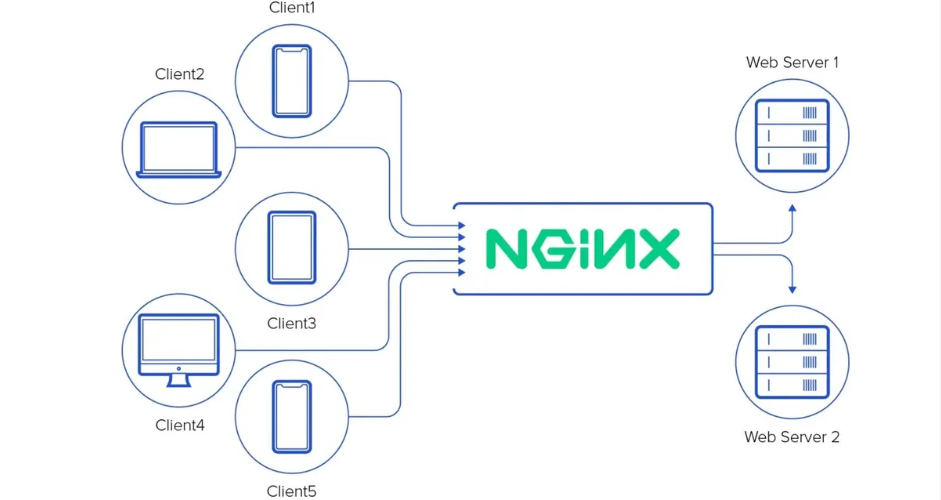
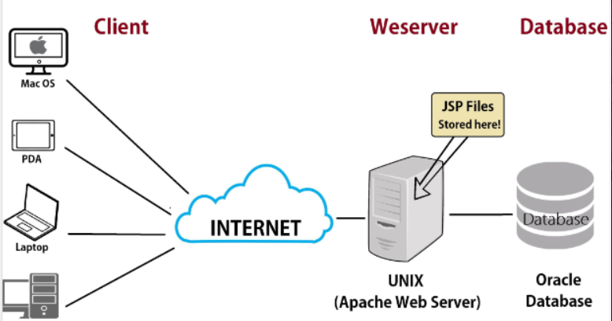

# 1. Nginx
## 1.1 Nginx là gì?

NGINX – Web server mạnh mẽ mã nguồn mở, với kiến trúc đơn luồng và hướng sự kiện, vượt trội so với Apache server về hiệu suất. Ngoài việc làm web server nhanh nhất, NGINX còn cung cấp các chức năng quan trọng như load balancing, HTTP caching và reverse proxy. Đây là kiến thức không thể thiếu đối với web developer, system administrator và devops. Với sự xuất sắc và ưu việt trong đo lường hiệu suất, NGINX là lựa chọn hàng đầu cho các dự án web, mang lại sự tăng cường và đáng tin cậy cho hệ thống.
## 1.2 Nginx có tính năng gì
- **Kiến trúc bất đồng bộ:** Nginx không tạo ra một luồng riêng cho mỗi yêu cầu mà sử dụng một cơ chế gọi là event loop (vòng lặp sự kiện). Với cơ chế này, một luồng chính của Nginx sẽ lắng nghe tất cả các sự kiện (yêu cầu từ người dùng) và phản hồi lại dựa trên từng sự kiện, thay vì phải tạo ra luồng riêng. Điều này giúp Nginx có thể xử lý hàng ngàn kết nối đồng thời mà không cần tăng thêm tài nguyên nhiều như Apache.

- **Hỗ trợ nhiều giao thức:** Ngoài HTTP và HTTPS, Nginx còn hỗ trợ các giao thức khác như WebSocket, IMAP, POP3, và SMTP, giúp nó có thể xử lý các yêu cầu liên quan đến giao thức email. Nginx hỗ trợ các giao thức quan trọng như HTTP/1.x, HTTP/2, và HTTPS, giúp cải thiện hiệu suất nhờ tính năng nén dữ liệu và truyền nhiều yêu cầu trên cùng một kết nối, mã hóa SSL/TLS để bảo mật kết nối. Ngoài HTTP, Nginx cũng hỗ trợ WebSocket để truyền dữ liệu thời gian thực và các giao thức khác như TCP, UDP.
- **Reverse proxy và Load Balancing:** Nginx có thể phân phối các yêu cầu dựa trên URI thay vì dựa vào file hệ thống. Điều này giúp nó trở thành một proxy ngược và bộ cân bằng tải hiệu quả, có thể phân phối yêu cầu giữa các máy chủ ứng dụng.

- **SSL Termination:** SSL là một yêu cầu cần thiết cho các trang web xử lý dữ liệu nhạy cảm, nhưng nó gây thêm tải cho máy chủ. Nginx có khả năng thực hiện SSL Termination, tức là xử lý mã hóa SSL tại tầng proxy và truyền dữ liệu không mã hóa tới các máy chủ web khác, giúp giảm tải cho máy chủ chính.

## 1.3 Ưu điểm của Nginx
- **Tốc độ xử lý nhanh:** Nginx được xây dựng để xử lý các yêu cầu theo kiến trúc bất đồng bộ (asynchronous), giúp nó có thể xử lý nhiều yêu cầu cùng lúc mà không bị chậm lại như các máy chủ truyền thống sử dụng kiến trúc đồng bộ.
- **Tăng tốc ứng dụng:** Nginx có thể đóng vai trò làm proxy ngược (reverse proxy), bạn có thể đặt Nginx phía trước các máy chủ web khác và để nó quản lý lưu lượng truy cập một cách hiệu quả. Nhờ vậy, Nginx giúp giảm tải cho các máy chủ chính, cải thiện hiệu suất xử lý tổng thể của hệ thống.
- **Cân bằng tải dễ dàng:** Nginx cho phép chia đều lưu lượng truy cập giữa các máy chủ mà không cần đến các thiết bị phần cứng phức tạp như load balancer vật lý. Nginx đóng vai trò như một điểm trung gian, nhận tất cả các yêu cầu từ người dùng và sau đó phân phối chúng đến các máy chủ phía sau một cách hợp lý,  giúp giảm thiểu tình trạng quá tải cho một máy chủ cụ thể.
- **Khả năng mở rộng tốt:** Với kiến trúc bất đồng bộ, Nginx không bị giới hạn về số lượng kết nối đồng thời như Apache hay IIS. Nó giải quyết tốt vấn đề C10K (10,000 kết nối đồng thời), một thách thức với các máy chủ truyền thống.
- **Nâng cấp không gián đoạn:** Nginx cho phép bạn thay đổi cấu hình hoặc nâng cấp phần mềm mà không cần khởi động lại toàn bộ hệ thống. Điều này có nghĩa là dịch vụ vẫn hoạt động liên tục, không bị gián đoạn khi thực hiện các thay đổi.
- **Dễ cài đặt và bảo trì:** Nginx có thể hoạt động tốt trên các hệ thống có cấu hình phần cứng thấp, nhờ vào cách nó quản lý tài nguyên hiệu quả. Ngay cả với cài đặt mặc định, Nginx vẫn cung cấp hiệu suất vượt trội so với nhiều máy chủ khác.
- **Dễ sử dụng:** Mặc dù không có giao diện đồ họa, Nginx có hệ thống cấu hình đơn giản, sử dụng file cấu hình rõ ràng và dễ chỉnh sửa. Khi bạn quen thuộc với cách Nginx hoạt động, việc tùy chỉnh nó theo nhu cầu trở nên dễ dàng hơn nhiều.
# 2. Apache
## 2.1 Apache là gì
Apache là một phần mềm mã nguồn mở được phát triển bởi Apache Software Foundation. Phần mềm này hoạt động như một máy chủ web, chịu trách nhiệm tiếp nhận và phản hồi các yêu cầu từ trình duyệt web của người dùng. Apache sử dụng giao thức HTTP và HTTPS để phục vụ nội dung web từ các tệp tin trên máy chủ đến các trình duyệt của người dùng. Apache đã được phát hành lần đầu vào năm 1995 và từ đó đến nay đã trở thành một trong những giải pháp máy chủ web phổ biến nhất thế giới.

## 2.2 Cách thức hoạt động của Apache
Apache hoạt động dựa trên mô hình Request-Response. Khi người dùng gửi một yêu cầu thông qua trình duyệt web của họ, yêu cầu này sẽ được gửi đến máy chủ nơi Apache đang chạy. Apache sau đó sẽ phân tích yêu cầu này và tìm kiếm tài nguyên thích hợp trên máy chủ (như một tệp HTML, hình ảnh, hoặc dữ liệu) để trả về cho trình duyệt. Quá trình này diễn ra nhanh chóng, cho phép người dùng truy cập trang web một cách mượt mà và hiệu quả.

## 2.3 Apache có tính năng gì
- **Tính năng URL Write:** Apache hỗ trợ viết lại URL thông qua module mod_rewrite, giúp tối ưu hóa SEO và tạo ra các URL thân thiện với người dùng. Đây là một tính năng quan trọng đối với các trang web muốn cải thiện thứ hạng trên các công cụ tìm kiếm.
- **Hỗ trợ Virtual Hosts:** Apache cho phép chạy nhiều trang web trên cùng một máy chủ thông qua tính năng Virtual Hosts. Điều này rất hữu ích cho các nhà phát triển và quản trị viên hệ thống muốn tiết kiệm tài nguyên và quản lý nhiều trang web trên cùng một hạ tầng.
- **Khả năng tương thích cao:** Apache hoạt động tốt trên nhiều hệ điều hành khác nhau, bao gồm Linux, Windows, macOS, và các hệ điều hành Unix-like khác. Apache cũng tương thích với nhiều ngôn ngữ lập trình và công nghệ web, giúp nó trở thành một giải pháp linh hoạt cho các nhà phát triển.
- **Hỗ trợ nhiều giao thức:** Bên cạnh giao thức HTTP và HTTPS, Apache còn hỗ trợ nhiều giao thức khác như FTP, SMTP, và WebDAV, giúp nó trở thành một giải pháp máy chủ toàn diện cho nhiều loại dịch vụ mạng.
## 2.4 Ưu điểm của Apache
- **Mã nguồn mở miễn phí:** Apache là phần mềm mã nguồn mở, có nghĩa là người dùng có thể sử dụng, sửa đổi và phân phối lại mà không phải trả phí bản quyền. Điều này giúp các doanh nghiệp, từ nhỏ đến lớn, có thể sử dụng Apache mà không lo lắng về chi phí.
- **Linh hoạt và tùy biến cao:** Nhờ vào kiến trúc module, Apache cho phép người dùng tùy chỉnh các tính năng và chức năng của máy chủ web theo nhu cầu cụ thể của họ. Người dùng có thể thêm hoặc bớt các module mở rộng để điều chỉnh hiệu suất và bảo mật của Apache.
- **Tính ổn định và hiệu suất cao:** Apache đã được phát triển và hoàn thiện trong hơn hai thập kỷ, điều này giúp nó trở thành một trong những máy chủ web ổn định và tin cậy nhất hiện nay. Apache có thể xử lý hàng triệu yêu cầu mỗi ngày mà không gặp phải các vấn đề về hiệu suất.
- **Hỗ trợ bảo mật mạnh mẽ:** Apache liên tục được cập nhật với các bản vá bảo mật và cải tiến hiệu năng, giúp giảm thiểu rủi ro bảo mật và bảo vệ trang web khỏi các cuộc tấn công từ bên ngoài. Các tính năng bảo mật của Apache bao gồm hỗ trợ SSL/TLS, cơ chế xác thực người dùng, và kiểm soát truy cập.
- **Cộng đồng hỗ trợ và tài liệu phóng phú:** Apache có một cộng đồng phát triển lớn và tích cực, cung cấp nhiều tài liệu hướng dẫn, diễn đàn, và nhóm hỗ trợ trực tuyến. Người dùng có thể dễ dàng tìm kiếm các tài liệu liên quan đến cài đặt, cấu hình, và khắc phục sự cố của Apache.
- **Khả năng tương thích cao với các ứng dụng web phổ biến:** Apache hỗ trợ nhiều ngôn ngữ lập trình và công nghệ web phổ biến như PHP, Python, Ruby, và Perl. Điều này giúp Apache có thể được sử dụng cho nhiều loại ứng dụng web khác nhau, từ các trang web tĩnh đến các ứng dụng web phức tạp.
# 3. So sánh Nginx và Apache
- **Hiệu năng:** 
  - Static content (Nội dung tĩnh là những dữ liệu không thay đổi hoặc chỉ thay đổi khi được chỉnh sửa thủ công bởi người quản trị web: trang giới thiệu, hình ảnh,...): Apache và Nginx có cơ chế xử lý kết nối khác nhau. Apache sử dụng phân luồng hoặc keep-alive, trong khi Nginx sử dụng vòng lặp sự kiện không bị ngăn chặn và tiến trình công việc. Điều này giúp Nginx tránh sự cố về CPU và RAM khi có nhiều truy cập cùng lúc. Ngoài ra, NGINX còn có tốc độ xử lý nhanh hơn, hiệu suất sử dụng bộ nhớ tốt hơn và tiêu thụ ít tài nguyên RAM và CPU. Điều này làm cho NGINX trở thành lựa chọn hàng đầu cho việc xử lý lượng truy cập lớn và đáng tin cậy.
  
  - Dynamic content (Nội dung động là dữ liệu thay đổi tùy vào tương tác của người dùng, thời gian hoặc các yếu tố khác: trang đăng nhập, đăng ký, giỏ hàng,...): Apache có thể xử lí nội dung động trong webserver mà không cần tới một yếu tố bên ngoài. Nginx không thể xử lí chúng với Webserver như cách mà Apache làm, nó sẽ đưa sang một proccess bên ngoài (Như PHP-FPM) để thực thi. Nginx chờ cho nội dung được xử lí xong quay trở lại và gửi lại cho client.
- **Hệ điều hành hỗ trợ:** 
  - Apache: Hỗ trợ tất cả những hệ thống dựa trên Unix như Linux hoặc BSD. Hỗ trợ đầy đủ MS-Windows
  - Nginx: Hỗ trợ phần lớn những hệ thống dựa trên Unix. Hỗ trợ một phần MS-Windows

|             Apache              |           Nginx                  |
|:--------------------------------|:---------------------------------|
| Được thiết kế làm webserver     | Có thể làm webserver hoặc một reverse proxy server|
| Khó khăn khi xử lý nhiều request liên tục khi lưu lượng web tăng cao | Có thể xử lý nhiều request với tài nguyên hệ thống hạn hẹp |
| Có cách tiếp cận đa luồng khi xử lý request | Có cách tiếp cận theo sự kiện khi xử lý request |
| Có thể xử lý nội dung động | Không thể xử lý nội dung động, phải đưa cho bên thứ 3 (PHP-FPM) |
