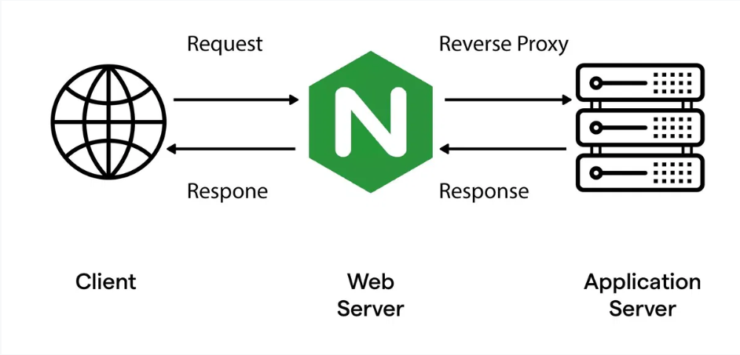
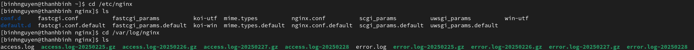
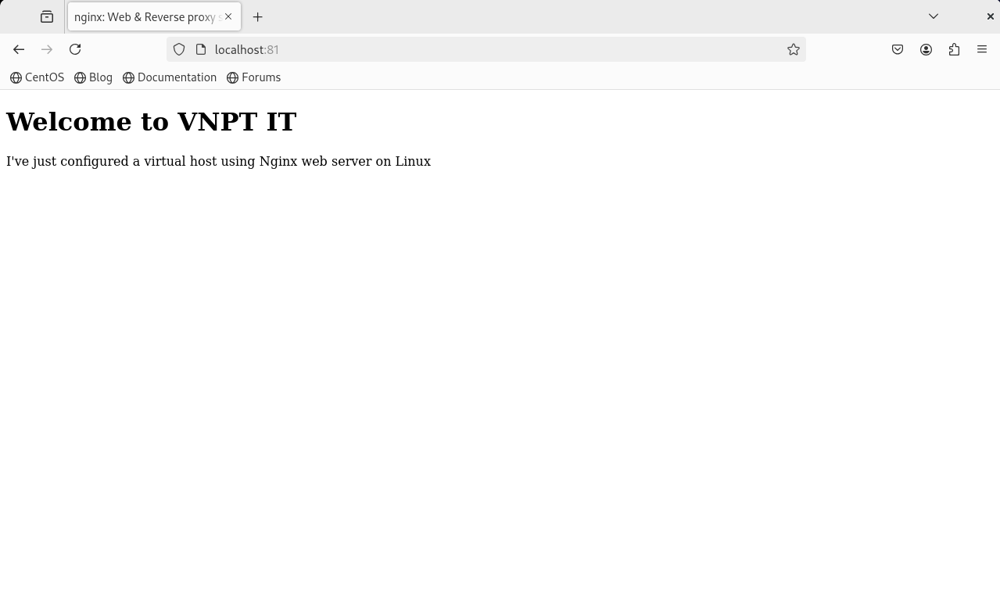

# NGINX
# 1. Nginx là gì?



NGINX – Web server mạnh mẽ mã nguồn mở, với kiến trúc đơn luồng và hướng sự kiện, vượt trội so với Apache server về hiệu suất. Ngoài việc làm web server nhanh nhất, NGINX còn cung cấp các chức năng quan trọng như load balancing, HTTP caching và reverse proxy. Đây là kiến thức không thể thiếu đối với web developer, system administrator và devops. Với sự xuất sắc và ưu việt trong đo lường hiệu suất, NGINX là lựa chọn hàng đầu cho các dự án web, mang lại sự tăng cường và đáng tin cậy cho hệ thống.
# 2. Nginx có tính năng gì?
- **Kiến trúc bất đồng bộ:** Nginx không tạo ra một luồng riêng cho mỗi yêu cầu mà sử dụng một cơ chế gọi là event loop (vòng lặp sự kiện). Với cơ chế này, một luồng chính của Nginx sẽ lắng nghe tất cả các sự kiện (yêu cầu từ người dùng) và phản hồi lại dựa trên từng sự kiện, thay vì phải tạo ra luồng riêng. Điều này giúp Nginx có thể xử lý hàng ngàn kết nối đồng thời mà không cần tăng thêm tài nguyên nhiều như Apache.


     - Cơ chế hoạt động:
        - Khi một yêu cầu đến, hệ điều hành tạo hoặc sử dụng một tiến trình mới để xử lý nó.
        - Một tiến trình chỉ có thể xử lý một yêu cầu tại một thời điểm.
        - Khi có nhiều yêu cầu đồng thời, nhiều tiến trình được tạo ra hoặc được điều phối để xử lý chúng.
        - Hệ thống cần thực hiện chuyển đổi ngữ cảnh (context switching) giữa các tiến trình để quản lý nhiều yêu cầu cùng lúc.
         
- **Hỗ trợ nhiều giao thức:** Ngoài HTTP và HTTPS, Nginx còn hỗ trợ các giao thức khác như WebSocket, IMAP, POP3, và SMTP, giúp nó có thể xử lý các yêu cầu liên quan đến giao thức email. Nginx hỗ trợ các giao thức quan trọng như HTTP/1.x, HTTP/2, và HTTPS, giúp cải thiện hiệu suất nhờ tính năng nén dữ liệu và truyền nhiều yêu cầu trên cùng một kết nối, mã hóa SSL/TLS để bảo mật kết nối. Ngoài HTTP, Nginx cũng hỗ trợ WebSocket để truyền dữ liệu thời gian thực và các giao thức khác như TCP, UDP.
- **Reverse proxy và Load Balancing:** Nginx có thể phân phối các yêu cầu dựa trên URI thay vì dựa vào file hệ thống. Điều này giúp nó trở thành một proxy ngược và bộ cân bằng tải hiệu quả, có thể phân phối yêu cầu giữa các máy chủ ứng dụng.


- **SSL Termination:** SSL là một yêu cầu cần thiết cho các trang web xử lý dữ liệu nhạy cảm, nhưng nó gây thêm tải cho máy chủ. Nginx có khả năng thực hiện SSL Termination, tức là xử lý mã hóa SSL tại tầng proxy và truyền dữ liệu không mã hóa tới các máy chủ web khác, giúp giảm tải cho máy chủ chính.


# 3. Cài đặt Nginx 
## 3.1 Trên Ubuntu
- Thực hiện chạy câu lệnh: *sudo apt install nginx* để tiến hành cài đặt nginx.

- Sau khi cài đặt xong, cần chạy lệnh *sudo systemctl start nginx* và *sudo systemctl enable nginx* để khởi động và kích hoạt nginx.

- Kiểm tra cài đặt nginx trên CentOS bằng cách gõ lệnh *sudo systemctl status nginx*, nếu xuất hiện active (running) thì việc cài đặt hoàn tất.


- Kiểm tra cài đặt nginx bằng việc vào trình duyệt web và thực hiện gõ http://192.168.139.134. Nếu thấy trang như hình dưới xuất hiện thì việc cài đặt apache thành công.


## 3.2 Trên CentOS
- Thực hiện chạy câu lệnh *sudo dnf install nginx -y* để tiến hành cài đặt nginx.

- Sau khi cài đặt xong, cần chạy lệnh *sudo systemctl start nginx* và *sudo systemctl enable nginx* để khởi động và kích hoạt nginx.

- Kiểm tra cài đặt nginx trên CentOS bằng cách gõ lệnh *sudo systemctl status nginx*, nếu xuất hiện active (running) thì việc cài đặt hoàn tất.


- Thực hiện kiểm tra lại bằng cách vào trình duyệt web và gõ http://192.168.139.132. Nếu thấy trang như hình dưới xuất hiện thì việc cài đặt apache thành công.


# 4. File cấu hình Nginx
- Mở tệp cấu hình Nginx:
```
$ vi /etc/nginx/sites-enabled/default  #[Trên Debian/Ubuntu]
$ vi /etc/nginx/nginx.conf             #[Trên CentOS/RH]
```


# 5. File log Nginx
- Mở tệp log của Nginx nằm trong thư mục /var/log/nginx bao gồm file access.log và error.log:

- Đường dẫn file access log là /var/log/nginx/access.log và đường dẫn file error log là /var/log/nginx/error.log


# 6. Sử dụng virtual cấu hình nhiều website trên một máy ảo chạy webserver
- **Tạo và cấu hình trang web**
  - Tạo một thư mục trong thư mục /var/www bằng lệnh mkdir. 

   

  - Tạo tập html trong thư mục bằng lệnh touch.
  
   

  - Mở tệp index.html bằng lệnh vi và chèn đoạn code sau vào file index.html
  
   ```
   <!doctype html>
  <html>
  <head>
  <meta charset="utf-8">
  <title>Nginx: Web & Reverse proxy server</title>
  </head>
   <body>
   <h1>Welcome to Nginx</h1>
   <p>I've just configured a virtual host using Nginx web server on Linux</p>
  </body>
  </html>
    ```

- **Định cấu hình webserver**
   - Để định cấu hình virtual host, trước tiên, hãy tạo tệp cấu hình virtual host cho trang web trong thư mục /etc/nginx/conf.d
   - Mở tệp vừa tạo bằng lệnh vi và chèn dòng mã như sau:
   
   ```
   server {
       listen 80;
       listen [::]:80;
       server_name binhnmt.com;
       root /var/www/testVirtualHost;
       index index.php index.html;
       access_log /var/www/web1/access.log;
       error_log /var/www/web1/error.log;
       location / {
           try_files $uri $uri/ =404;
       }
   }
   ```

- **Định cấu hình DNS**
    - Mở file trong thư mục */etc/hosts và thêm tên miền binhnmt.com tương ứng với địa chỉ ip của máy chủ

   

- **Khởi động lại máy chủ Nginx**
   - Khởi động lại máy chủ Nginx để lưu các thay đổi đã thực hiện bằng câu lệnh *sudo systemctl restart nginx*.

- **Thử kết nối đến trang web bằng điều hướng đến URL http://localhost:81 hoặc http://binhnmt.com:81**

   

Tài liệu tham khảo

[1] (https://cloud.z.com/vn/news/nginx/)

[2] (https://blog.cloud365.vn/linux/huong-dan-tao-virtualhost-trong-nginx/)

[3] (https://zhost.vn/tai-lieu/cau-hinh-virtual-host-cho-nginx-centos-ubuntu/)
