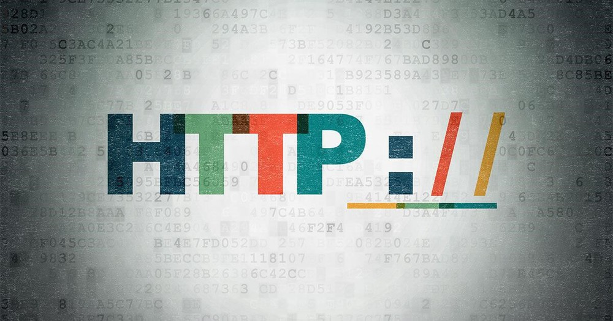

# HTTP VÀ HTTPS
# 1. HTTP
## 1.1 HTTP là gì?
HTTP được biết đến như một giao thức truyền tải các siêu văn bản. Nó được dùng trong www để truyền dữ liệu qua lại giữa máy chủ web và trình duyệt. Kỹ thuật HTTP sẽ quyết định cách dữ liệu yêu cầu được gửi đến máy chủ cũng như cách thức máy chủ phản hồi.

Hiểu đơn giản, HTTP là giao thức chuyên để phân phối các dữ liệu trên www. Giao thức này sử dụng cổng TCP 80 để truyền tải thông tin, giúp các máy tính giao tiếp với nhau.

## 1.2 Cách thức hoạt động của HTTP
HTTP hoạt động theo nguyên lý: Client khởi tạo yêu cầu (tạo kết nối TCP tới cổng 80 hoặc một cổng khác trên server) -> server nhận yêu cầu -> gửi lại trạng thái đến cho client kèm theo thông điệp (thông điệp ở đây thường sẽ là thông tin yêu cầu, thông báo lỗi hay thông tin khác).
## 1.3 Cấu trúc cơ bản của HTTP
Cấu trúc của HTTP bao gồm 2 đối tượng là Client và Server. Có thể coi HTTP như giao thức gửi các yêu cầu và phản hồi giữa Client - Server. Tại giao thức này, mọi thiết bị tìm kiếm hay trình duyệt web sẽ đóng vai trò như máy khách, còn máy chủ web có vai trò như Server. 
- **Client:** Client (máy khách) gửi yêu cầu cụ thể đến Server theo mẫu phương thức yêu cầu -> Các phiên bản giao thức cùng với URI gửi thông báo MIME (gồm thông tin máy khách, nội dung của đối tượng, bộ chỉnh sửa) đến server qua kết nối TCP/IP.
- **Server:** Server nhận được yêu cầu -> Phản hồi lại bằng một dòng trạng thái qua thông báo MIME có chứa thông tin máy chủ, thông tin về nội dung của đối tượng và thực thể của đa phương tiện.

## 1.4 URL
URL là dạng viết tắt của Uniform Resource Locator với ý nghĩa là vị trí của một trang web trên Internet. Một URL có cấu trúc như sau

scheme://hostname[:port]/path?query#fragment

Trong một URL có 4 thành phần :

- Scheme: Là phương thức mà trình duyệt web của bạn dùng để giao tiếp với server. Các scheme phổ biến bao gồm:
     - http: Giao thức truyền tải siêu văn bản (HyperText Transfer Protocol).
     - https: Giao thức truyền tải siêu văn bản an toàn (HyperText Transfer Protocol Secure).
     - ftp: Giao thức truyền tệp (File Transfer Protocol). -mailto: Địa chỉ email.
     - tel: Số điện thoại.
- Hostname: Là tên của máy chủ lưu trữ tài nguyên.
- Port: Là cổng kết nối giữa trình duyệt và máy chủ.
- Path: Là đường dẫn đến tài nguyên.
- Query: Là các tham số truy vấn.
- Fragment: Là một phần của URL có thể được sử dụng để đánh dấu vị trí của một phần cụ thể trong tài nguyên
## 1.5 Session
Trong giao thức HTTP, mỗi session bao gồm 3 giai đoạn(bắt tay 3 bước TCP)

- Client thiết lập kết nối TCP tới Server (hoặc 1 kết nối thích hợp khác nếu tầng vận chuyển không sử dụng TCP)
- Client gửi request và đợi phản hồi
- Server nhận được request sẽ phản hồi lại cho Client cung cấp status code và dữ liệu phù hợp.

Session được lưu trên máy Server. Nó chứa dữ liệu người sử dụng web vào 1 file trên server.
## 1.6 Proxy
Proxy được hiểu đơn giản là sợi dây liên kết giữa người truy cập Internet và Internet, dùng để thực hiện chuyển tiếp thông tin và kiểm soát sự an toàn cho người dùng. Có thể nói, cách thức hoạt động của Proxy như một tường lửa (firewall), hoặc là một bộ lọc truy cập web.

- Cấu trúc proxy trong HTTP bao gồm 3 thành phần chính:

  - Client: là trình duyệt web hoặc ứng dụng HTTP khác.
  - Proxy server: là máy chủ trung gian giữa client và server web.
  - Server web: là máy chủ lưu trữ tài nguyên web.

Cách hoạt động của proxy trong HTTP như sau:

   - Client gửi yêu cầu HTTP đến proxy server.
   - Proxy server nhận yêu cầu và chuyển tiếp yêu cầu đến server web.
   - Server web xử lý yêu cầu và gửi phản hồi đến proxy server.
   - Proxy server nhận phản hồi và chuyển tiếp phản hồi đến client.
## 1.7 HTTP message
HTTP Message (Thông điệp HTTP) là các thông tin được trao đổi qua lại giữa client và server. Có hai kiểu HTTP Message: HTTP Request Message (Request) được gửi đi bởi client tới server - khi server nhận được nó biết phải thực hiện nhiệm vụ nào đó, HTTP Response Message (Response) là trả lời từ server về cho client.
# 2. HTTPS
## 2.1 HTTPS là gì?
HTTPS là giao thức HTTP có cài đặt chứng chỉ bảo mật SSL.

## 2.2 Cách thức HTTPS hoạt động
HTTP truyền dữ liệu không được mã hóa, tức là các bên thứ ba có thể chặn và đọc thông tin được gửi từ trình duyệt. Đây không phải là một quá trình lý tưởng, do đó HTTP đã được mở rộng thành HTTPS để thêm một lớp bảo mật khác vào giao tiếp. HTTPS kết hợp các yêu cầu và phản hồi HTTP với công nghệ SSL và TLS.

Các trang web HTTPS phải đạt được chứng chỉ SSL/TLS từ nhà cung cấp chứng chỉ (CA) độc lập. Các trang web này chia sẻ chứng chỉ với trình duyệt trước khi trao đổi dữ liệu để thiết lập sự tin cậy. Chứng chỉ SSL cũng chứa thông tin mật mã hóa, cho phép máy chủ và trình duyệt web có thể trao đổi dữ liệu được mã hóa hoặc bị làm nhiễu. Quá trình này hoạt động như sau:

- Bạn truy cập vào một trang web HTTPS bằng cách nhập định dạng URL https:// vào thanh địa chỉ của trình duyệt.
- Trình duyệt sẽ xác minh tính xác thực của trang web bằng cách yêu cầu chứng chỉ SSL của máy chủ.
- Máy chủ sẽ trả lời bằng cách gửi chứng chỉ SSL có chứa một khóa công khai.
- Chứng chỉ SSL của trang web chứng minh danh tính máy chủ. Khi hài lòng với phản hồi, trình duyệt sẽ sử dụng khóa công khai để mã hóa và gửi một thông điệp có chứa một khóa phiên bí mật.
- Máy chủ web sử dụng khóa riêng của nó để giải mã thư và truy xuất khóa phiên. Sau đó, máy chủ web sẽ mã hóa khóa phiên và gửi một thông điệp xác nhận đến trình duyệt.
- Bây giờ, cả trình duyệt và máy chủ web chuyển sang sử dụng khóa phiên tương tự để trao đổi tin nhắn một cách an toàn.
## 2.3 Sự khác biệt giữa HTTP và HTTPS

|         |             HTTP              |           HTTPS                |
|:--------|:--------------------------------|:---------------------------------|
|Là viết tắt của| Giao thức truyền siêu văn bản     | Giao thức truyền siêu văn bản bảo mật|
|Giao thức cơ bản| HTTP/1 và HTTP/2 sử dụng TCP/IP. HTTP/3 sử dụng giao thức QUIC. | Sử dụng HTTP/2 với SSL/TLS để mã hóa thêm cho các yêu cầu và phản hồi HTTP |
|Cổng| Cổng mặc định là 80 | Cổng mặc định là 443 |
|Trường hợp sử dụng| Các trang web dựa trên văn bản cũ hơn | Tất cả các trang web hiện đạ |
|Bảo mật| Không có tính năng bảo mật bổ sung | Sử dụng chứng chỉ SSL để mã hóa khóa công khai |
|Lợi ích| Hỗ trợ giao tiếp qua internet | Cải thiện độ uy tín, độ tin cậy và xếp hạng công cụ tìm kiếm của trang web |

Tài liệu tham khảo

[1] (https://bizfly.vn/techblog/http-la-gi.html)

[2] (https://aws.amazon.com/vi/compare/the-difference-between-https-and-http/)

[3] (https://fptshop.com.vn/tin-tuc/danh-gia/proxy-la-gi-nhung-dieu-huu-ich-ban-can-biet-ve-proxy-147017-147017)